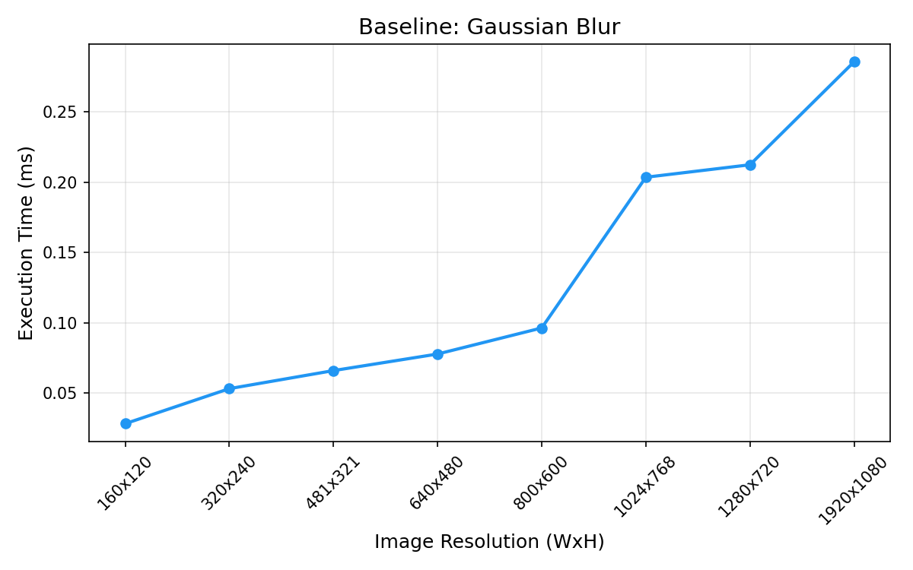
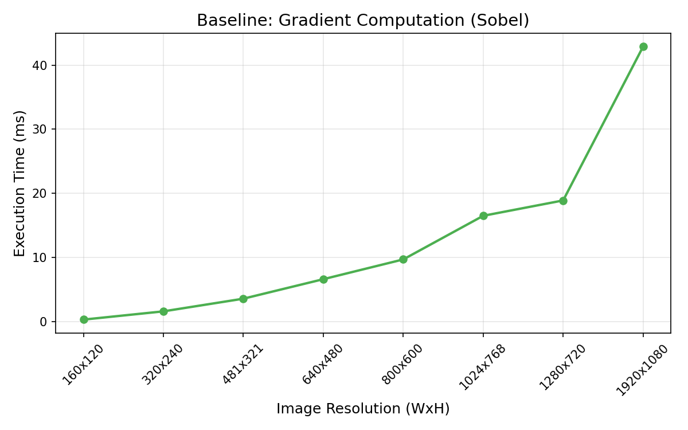
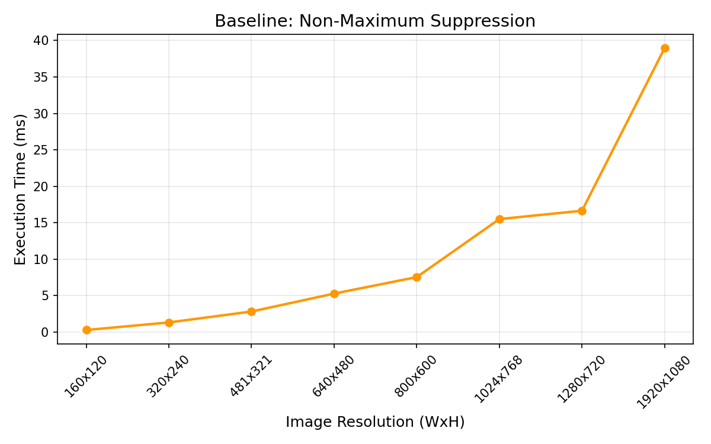
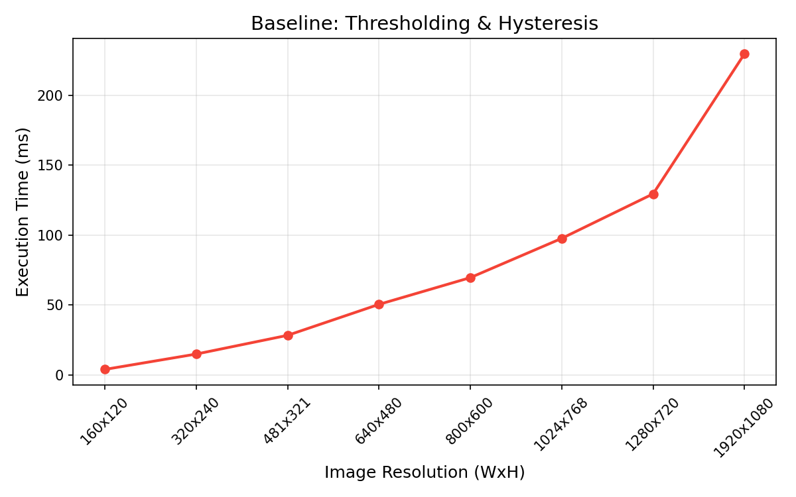

# 18-646: How to Write Fast Code II — Project Midterm Report

## GPU-Accelerated Canny Edge Detection

**Team:** Siddarth Kunisetty, Kushaan Misra, Adrian Munoz

---

## 1. Performance Baseline

We established our baseline using the OpenCV `cv2.Canny()` CPU implementation, profiled on images from the BSDS500 dataset. We decomposed the Canny pipeline into its four constituent stages and measured each independently to identify per-kernel bottlenecks. All baseline measurements were collected on an Apple Silicon (ARM) processor running macOS, using Python 3 with OpenCV 4.13.0 and NumPy 2.4.4. Each measurement is averaged over 5 trials after 2 warmup runs.

### Methodology

Each stage was isolated and timed separately:

1. **Gaussian Blur** — `cv2.GaussianBlur()` with a 5x5 kernel, sigma = 1.4
2. **Gradient Computation (Sobel)** — `cv2.Sobel()` in both x and y directions, plus magnitude and angle computation
3. **Non-Maximum Suppression (NMS)** — Custom Python/NumPy implementation that thins edges along the gradient direction
4. **Double Thresholding & Hysteresis** — Classifies pixels as strong/weak/non-edge and performs connected-component edge linking

### 1.1 Gaussian Blur Baseline

The Gaussian blur stage scales roughly linearly with the number of pixels. For a 481x321 image (BSDS500 standard), the average execution time is approximately 0.07 ms, scaling to 0.29 ms at 1920x1080. This stage is the fastest due to OpenCV's highly optimized C++ convolution backend. Complexity is O(N * K^2), where N is pixel count and K is kernel width.

### 1.2 Gradient Computation (Sobel) Baseline

Gradient computation involves two 3x3 convolutions (Sobel Gx and Gy) plus per-pixel magnitude (sqrt(Gx^2 + Gy^2)) and angle (arctan(Gy/Gx)) computations. The convolution portion is similar in cost to Gaussian blur, but the element-wise magnitude and angle operations (computed in NumPy) add significant per-pixel cost. Average time for a 481x321 BSDS500 image: 3.57 ms, scaling to 42.88 ms at 1920x1080.

### 1.3 Non-Maximum Suppression Baseline

NMS is a per-pixel operation comparing each pixel's gradient magnitude against two neighbors along the gradient direction. Our vectorized NumPy implementation processes all four gradient direction bins simultaneously. The data-dependent access pattern makes this stage less cache-friendly on CPU. Average time for a 481x321 image: 2.81 ms, scaling to 38.96 ms at 1920x1080.

### 1.4 Double Thresholding & Hysteresis Baseline

Hysteresis is by far the most expensive stage, dominating the pipeline at 81.4% of total execution time. Double thresholding is simple O(N) classification, but edge-linking requires iterative BFS from strong edge pixels through weak pixels. The sequential, data-dependent nature of BFS makes this the primary bottleneck and the strongest candidate for GPU acceleration. Average time for a 481x321 image: 28.28 ms, scaling to 229.78 ms at 1920x1080.

### End-to-End Baseline Summary

| Stage | Avg Time (ms) | % of Total |
|---|---|---|
| Gaussian Blur | 0.07 | 0.2% |
| Gradient Computation | 3.57 | 10.3% |
| Non-Maximum Suppression | 2.81 | 8.1% |
| Thresholding & Hysteresis | 28.28 | 81.4% |
| **Total (end-to-end)** | **34.73** | **100%** |
| OpenCV `cv2.Canny()` | 0.32 | — |

---

## 2. Parallelism Analysis and Initial Mapping

We analyze the parallelism available in each stage and describe our strategy for mapping computation onto NVIDIA GPU hardware using CUDA.

### Kernel 1: Gaussian Blur

**Available Parallelism:**
Gaussian blur is a 2D convolution where each output pixel is computed independently — embarrassing parallelism across all N output pixels. The Gaussian kernel is *separable*: the 2D KxK convolution decomposes into two 1D passes (horizontal then vertical), reducing arithmetic from O(K^2) to O(2K) per pixel.

**Mapping Strategy:**
We map each output pixel to one CUDA thread. Threads are organized into 2D thread blocks (e.g., 16x16 = 256 threads per block). Each block processes a tile of the output image. We exploit separability by launching two kernels: a row-wise pass followed by a column-wise pass.

**Shared Memory Usage:**
Each thread block loads its required input tile (including halo regions of width floor(K/2)) into shared memory before computation. For a 16x16 output tile with a 5x5 kernel, the shared memory tile is 20x20 pixels. Halo elements are loaded by boundary threads. This eliminates redundant global memory reads — without shared memory, each input pixel would be read up to K times across neighboring threads.

**Memory Access Pattern:**
Input data is stored in row-major order. The row-wise pass achieves coalesced global memory reads. The column-wise pass has strided global accesses; shared memory tiling mitigates this by converting strided reads into coalesced block-level loads.

**Rationale:**
Tiled convolution with shared memory is the canonical GPU optimization for stencil operations. The separable decomposition halves arithmetic intensity while maintaining full parallelism. The 16x16 block size balances occupancy (256 threads/block) with shared memory footprint.

**Responsibility:** [TODO: Assign]

---

### Kernel 2: Gradient Computation (Sobel)

**Available Parallelism:**
The Sobel operator applies two 3x3 convolutions (Gx and Gy) independently per pixel. Magnitude and angle computations are element-wise with no inter-pixel dependencies. All N pixels can be processed in parallel.

**Mapping Strategy:**
Each thread computes Gx, Gy, magnitude, and angle for a single pixel. Same 2D thread block structure (16x16). Since the Sobel kernel is small (3x3), we apply both Gx and Gy in a single *fused kernel* to avoid an extra global memory round-trip. Magnitude and angle are computed inline.

**Shared Memory Usage:**
Each block loads an 18x18 tile (16x16 output region + 1-pixel halo on each side) into shared memory. Both Gx and Gy reads come from this shared tile, so each input pixel is loaded from global memory exactly once per block.

**Rationale:**
Fusing Gx, Gy, magnitude, and angle into one kernel avoids writing and re-reading four intermediate buffers. The 3x3 halo is small, so shared memory overhead is minimal.

**Responsibility:** [TODO: Assign]

---

### Kernel 3: Non-Maximum Suppression

**Available Parallelism:**
Each pixel's suppression decision depends only on its own gradient magnitude and two neighbors along the gradient direction. The neighbor lookup is data-dependent (varies with gradient angle), but computation is still *pixel-parallel*: every output pixel can be computed independently.

**Mapping Strategy:**
Each thread processes one pixel. The thread reads the gradient angle, determines which two neighbors to compare (quantized to 0, 45, 90, or 135 degrees), and suppresses the pixel if not a local maximum. Thread blocks: 16x16.

**Shared Memory Usage:**
Gradient magnitude tile (with 1-pixel halo) is loaded into shared memory since each pixel may access neighbors in any of four directions. Gradient angle array is read from global memory (each angle read once — no reuse benefit from shared memory).

**Warp Divergence:**
The four-way branch on gradient direction causes some warp divergence. However, natural images tend to have spatially coherent gradient directions, so threads within a warp often follow similar paths. Quantizing to 4 bins limits divergence to at most 4 paths per warp.

**Rationale:**
Despite data-dependent access patterns, NMS is fundamentally pixel-parallel. Shared memory for the magnitude tile ensures irregular neighbor accesses hit fast on-chip memory rather than global memory.

**Responsibility:** [TODO: Assign]

---

### Kernel 4: Double Thresholding and Hysteresis

**Available Parallelism:**
Double thresholding is trivially parallel — each pixel is independently classified as strong (> T_high), weak (T_low < x <= T_high), or non-edge (<= T_low).

Hysteresis (edge linking) is more challenging. A weak pixel becomes an edge only if connected (8-connectivity) to a strong pixel. This is equivalent to connected-component labeling, which has iterative data dependencies.

**Mapping Strategy (two sub-kernels):**

1. **Thresholding kernel:** One thread per pixel. Classifies into strong (2), weak (1), or non-edge (0). Fully parallel.
2. **Hysteresis kernel (iterative):** Parallel iterative propagation. Each iteration: every weak pixel checks its 8 neighbors — if any is strong, the weak pixel is promoted to strong. Iterations repeat until convergence (no more promotions). Each iteration is fully parallel; convergence is checked via an atomic flag.

**Shared Memory Usage:**
During each hysteresis iteration, each block loads its tile (with 1-pixel halo) of the edge classification map into shared memory. 8-connectivity neighbor lookups are serviced from shared memory. The convergence flag resides in global memory (atomic).

**Warp Divergence:**
Divergence between strong, weak, and non-edge pixels. Only weak pixels perform neighbor checks; others exit early. The weak pixel ratio decreases with each iteration, reducing divergence over time.

**Rationale:**
Iterative propagation avoids sequential BFS/DFS used on CPUs. Each iteration is O(N) work, and convergence typically occurs within 5-15 iterations for natural images. This trades total work for massive parallelism.

**Responsibility:** [TODO: Assign]

---

### Data Layout

All images stored in row-major order as contiguous 2D arrays of `float32` (input `uint8` converted on GPU). Intermediate buffers (blurred image, Gx, Gy, magnitude, angle, edge map) are pre-allocated to avoid per-frame allocation overhead. Pitched memory allocation (`cudaMallocPitch`) ensures row alignment for coalesced access.

### Pipelining (Stretch Goal)

For video/batch processing, we plan to pipeline the four stages using CUDA streams. While frame n undergoes hysteresis, frame n+1 can undergo NMS, frame n+2 gradient computation, and frame n+3 Gaussian blur — all concurrently on different SMs.

### Responsibility Summary

| Kernel | Primary Owner | Effort Split |
|---|---|---|
| Gaussian Blur | [TODO] | [TODO]% |
| Gradient Computation (Sobel) | [TODO] | [TODO]% |
| Non-Maximum Suppression | [TODO] | [TODO]% |
| Thresholding & Hysteresis | [TODO] | [TODO]% |
